# AarogyaVani (आरोग्यवाणी)
## Comprehensive System Architecture, Clinical Engineering & Technical Whitepaper

> **Document Type:** Architectural Blueprint & Engineering Specification  
> **Target Audience:** Technical Architects, Clinical Evaluators, Frontline Health Planners, and System Judges  
> **Note on Scope:** This document is distinct from a basic `README.md`. While a README focuses on installation commands, this whitepaper details the **foundational design philosophies, ground realities of rural Indian healthcare, end-to-end multi-model pipelines, clinical safety guardrails, and technical trade-offs** engineered into AarogyaVani.

---

## 1. Executive Summary & The Ground Reality

### The Rural Indian Healthcare Trilemma
India’s rural healthcare system serves over **850 million citizens** spread across 600,000+ villages. This population faces a severe structural trilemma:

1. **Severe Provider Scarcity**: While the WHO recommends a doctor-to-population ratio of 1:1,000, rural India often experiences ratios exceeding **1:25,000**.
2. **Literacy & Linguistic Diversity**: High rates of functional illiteracy combined with 22 official scheduled languages and hundreds of rural dialects make text-based digital health apps virtually useless for everyday villagers.
3. **Delayed Critical Triage**: Patients frequently travel 30–50 kilometers to a Community Health Centre (CHC) or District Hospital only to discover their condition was either a benign self-limiting illness or, tragically, a critical emergency that should have received an immediate ambulance dispatch hours earlier.

### The Frontline Linchpin: ASHA Workers
The **Accredited Social Health Activist (ASHA)** network consists of over **1 million female community health volunteers**. ASHAs act as the primary interface between rural families and public health facilities (Sub-Centres, PHCs, and CHCs). However, ASHAs:
* Are overburdened with paper registers and administrative logs.
* Have basic primary training but lack diagnostic specialist tools.
* Struggle to decipher illegible handwritten prescriptions from previous doctor visits.

### The AarogyaVani Solution
**AarogyaVani (आरोग्यवाणी)** is an AI-powered, voice-first clinical triage assistant designed for frontline ASHA workers and rural citizens. It captures spoken complaints in regional Indian languages and rural dialects, digitizes handwritten doctor prescriptions via multimodal vision, executes hardcoded deterministic danger-sign safety gates, performs clinical risk stratification (RED / YELLOW / GREEN), and synthesizes calming native voice guidance alongside an official National Health Mission referral slip.

---

## 2. Core Philosophy & Architectural Mindset ("What Thoughts in Mind")

When building AarogyaVani, every architectural decision was governed by five uncompromising principles:

```
┌────────────────────────────────────────────────────────────────────────┐
│                      AAROGYAVANI CORE PRINCIPLES                       │
├────────────────────────────────────────────────────────────────────────┤
│ 1. Voice-First, Vernacular-Native   → Speech is the primary UI        │
│ 2. Deterministic Safety Over AI      → Hardcoded gates trump LLMs      │
│ 3. Clinical Triage, Not Diagnosis   → Risk stratify, never prescribe   │
│ 4. Resilient Multi-Engine Fallback   → Zero single points of failure   │
│ 5. Dual-Persona Architecture         → Citizen simplicity + ASHA rigor │
└────────────────────────────────────────────────────────────────────────┘
```

### Principle 1: Voice-First, Vernacular-Native
In rural healthcare, **a keyboard is an impediment**. Asking an elderly villager or a hurried ASHA worker to type medical symptoms on a smartphone keyboard results in incomplete, mistyped, or abandoned inputs.
* Speech acoustics in the patient's native dialect is the highest-fidelity signal.
* Language selection must be **automatic**. Users should not navigate drop-down menus; the system must auto-detect whether the speaker is using Hindi, Bengali, Telugu, Marathi, or a dialect like Bhojpuri.

### Principle 2: Deterministic Safety Over Probabilistic AI
Large Language Models (LLMs) are probabilistic token generators. In medical triaging, **a 1% hallucination rate on an acute myocardial infarction or neonatal seizure is unacceptable**.
* **Clinical Red-Flag Gates are Hardcoded**: If a patient says *"seene mein dard"* (chest pain) or *"hosh nahi hai"* (unresponsive), the system **immediately triggers a RED emergency alert without waiting for or relying on an LLM**.
* The LLM is restricted to nuanced triage categorization (YELLOW vs. GREEN) and structuring actionable home-care guidance.

### Principle 3: Clinical Triage, Never Definitive Diagnosis
AarogyaVani operates under strict medical ethics:
* **The system never declares**: *"You have Malaria"* or *"You have Pneumonia."*
* **The system always stratifies**: *"Needs Attention (YELLOW) — visit the Primary Health Centre within 1-2 days for evaluation"* or *"Emergency (RED) — call 108 Ambulance immediately."*
* This protects patients from false reassurance and keeps community health workers within their clinical scope of practice.

### Principle 4: Resilient Multi-Engine Fallback
Rural connectivity is intermittent, and individual AI APIs can experience rate limits (HTTP 429), regional outages, or acoustic failures.
* AarogyaVani does not rely on a single AI provider.
* Speech recognition employs **Sarvam AI Saaras v4** as the primary Indian acoustics engine, backed by a **Gemini Multimodal Audio Cascade** that catches unlisted rural dialects and background tractor/market noise.
* Gemini calls automatically rotate across four models (`gemini-3.5-flash-lite`, `gemini-flash-lite-latest`, `gemini-3.8-flash`, and `gemini-2.5-flash`).

### Principle 5: Dual-Persona Experience (Patient vs. ASHA)
* **मरीज़ (Citizen) Mode**: Frictionless, zero-setup interface. Citizens press the microphone orb, speak their troubles, touch the interactive body map, and receive immediate spoken guidance.
* **आशा (ASHA) Mode**: Unlocks formal beneficiary demographic registration (Name, Age, Gender), clinical vitals gauges (Temperature, Pulse, Blood Pressure, SpO2), and digital referral certification for PHC doctors.

---

## 3. End-to-End System Pipeline

The diagram below traces the end-to-end journey of patient audio and prescription data through the AarogyaVani architecture:

```mermaid
sequenceDiagram
    autonumber
    actor User as Patient / ASHA Worker
    participant FE as React Client (Frontend)
    participant Func as Serverless Functions (/api)
    participant Sarvam as Sarvam AI Engine
    participant Gemini as Google Gemini Cascade
    participant Rules as Deterministic Danger Engine

    User->>FE: Speaks symptom voice note (Hindi / Dialect)
    FE->>Func: POST /api/voice (Audio Blob)
    
    rect rgb(10, 30, 45)
        Note over Func,Sarvam: Stage 1: Automatic Speech Recognition (LID)
        Func->>Sarvam: POST /speech-to-text (saaras:v4, language_code: unknown)
        alt Sarvam Success
            Sarvam-->>Func: Transcript + Detected Language (e.g., bn-IN, hi-IN, mr-IN)
        else Acoustic Failure / Dialect Low Confidence
            Func->>Gemini: Multimodal Audio Transcription Cascade
            Gemini-->>Func: Standardized Hindi + English Transcripts
        end
    end

    rect rgb(15, 35, 30)
        Note over Func,Sarvam: Stage 2: Cross-Language Translation
        Func->>Sarvam: POST /translate (Mayura: DetectedLang -> English & Hindi)
        Sarvam-->>Func: Clinical English + Standard Devanagari Hindi
    end

    Func-->>FE: Return transcripts & detected language

    opt User Uploads Doctor Prescription / Lab Report
        User->>FE: Snaps photo of paper prescription
        FE->>Func: POST /api/scan (Image File)
        Func->>Gemini: Vision Multimodal OCR (Extract medicines & dosage)
        Gemini-->>Func: Structured Digitized Text
        Func-->>FE: Digitized prescription summary
    end

    User->>FE: Clicks "स्वास्थ्य जांच करें (Generate Health Guide)"
    FE->>Func: POST /api/check (Symptoms + Vitals + Body Regions + OCR Text)

    rect rgb(50, 15, 20)
        Note over Func,Rules: Stage 3: Instant Deterministic Danger Gate
        Func->>Rules: Check Danger Sign Keywords (Chest pain, breathing distress, etc.)
        alt Danger Sign Detected (RED ALERT)
            Rules-->>Func: IMMEDIATE RED LEVEL (Bypasses LLM)
            Func->>Sarvam: POST /text-to-speech (Bulbul v3: Emergency Hindi audio)
            Sarvam-->>Func: Base64 Audio
            Func-->>FE: RED Alert Response (Call 108 Ambulance hotline)
        end
    end

    rect rgb(15, 25, 40)
        Note over Func,Gemini: Stage 4: Multimodal Clinical Reasoning
        Func->>Gemini: Structured Clinical Prompt + Strict JSON Schema
        Gemini-->>Func: Triage Level (YELLOW / GREEN), Clinical Reasons, Protocol Steps
    end

    rect rgb(20, 40, 30)
        Note over Func,Sarvam: Stage 5: Voice Synthesis
        Func->>Sarvam: POST /text-to-speech (Bulbul v3, Voice: Priya, Pace: 0.9)
        Sarvam-->>Func: Base64 Audio
    end

    Func-->>FE: Return Triage Guide + Audio + Action Steps
    FE->>User: Displays Triage Shield, Plays Hindi Voice Guidance, Renders ASHA Referral Slip
```



---

## 4. Pipeline Stages: Deep Technical Breakdown

### Stage 1: Audio Capture & Acoustic Ingestion
* **Browser Media Capture**: Recorded via the HTML5 `MediaRecorder` API using the `audio/webm;codecs=opus` codec.
* **Volume Metering & Noise Floor**: Monitored via Web Audio API `AudioContext` and `AnalyserNode` to provide live animated acoustic equalizer bars.
* **Zero-Byte & Silent Audio Guards**: The client checks recorded blob sizes and duration (< 1.5s is rejected with a polite prompt: *"रिकॉर्डिंग बहुत छोटी है, कृपया दोबारा बोलें"*).
* **Sample Audio Fallbacks**: Includes pre-recorded wav samples (`sample-fever.wav` and `sample-emergency.wav`) for offline demonstrations, network stress tests, and automated QA.

### Stage 2: Dual-Engine ASR & Dialect Bridging
* **Primary Engine — Sarvam AI Saaras v4**:
  * Specialized in Indian accents and background acoustics.
  * Configured with `language_code: 'unknown'`. This activates **Language Identification (LID)** on the fly, accurately detecting whether the audio is Hindi, Bengali, Telugu, Tamil, Marathi, Gujarati, Kannada, Malayalam, Punjabi, Odia, or Indian English.
* **Dialect Cascade — Google Gemini Multimodal Audio**:
  * Rural speakers frequently speak sub-regional vernacular or non-standard dialects (e.g., Bhojpuri: *"हमार गोड़ पिरात बा"*, Awadhi, Maithili, Rajasthani, Marwari, Chhattisgarhi, Haryanvi, or code-mixed Hinglish).
  * If Sarvam experiences an acoustic failure or unsupported dialect, the raw audio buffer is transmitted to Gemini's native audio multimodal parser with instructions to normalize colloquial symptoms into standardized clinical concepts.

### Stage 3: Semantic Standardization & Translation
* Clinical safety rules and international triage guidelines rely on standardized medical terminology (e.g., *dyspnea*, *tachycardia*, *diaphoresis*).
* **Mayura Neural Translation Engine**:
  * Dynamically translates the detected source language into **Clinical English** for triage evaluation.
  * Concurrently produces **Devanagari Hindi** for the user interface and local Primary Health Centre medical records.

### Stage 4: Deterministic Danger-Sign Safety Gate (The Emergency Guard)
* **Zero AI Latency**: Evaluated deterministically in O(N) string-matching time before calling external generative models.
* **Hardcoded Clinical Red Flags**:
  * Cardiovascular: Chest pain, radiating pain, seene mein dard, chaati mein dabav.
  * Respiratory: Acute breathing distress, breathlessness, saans nahi aa rahi, dum ghut raha.
  * Neurological: Unconsciousness, fainting, behosh, convulsions, seizures, daura, mirgi.
  * Obstetrical / Hemorrhagic: Heavy bleeding, postpartum hemorrhage, bahut khoon behna.
  * Pediatric: Lethargy, inability to feed or drink, severe vomiting.
* **Action**: Instantly locks the assessment to **RED**, generates emergency voice guidance, highlights the `tel:108` speed-dial button, and bypasses LLM inference.

### Stage 5: Vision Document Digitization (Prescription OCR)
* Handwritten doctor prescriptions in India are notoriously difficult for standard OCR tools (Tesseract, cloud vision) due to doctor cursive shorthand, crinkled paper, and poor camera lighting in rural huts.
* **Gemini Multimodal Vision**:
  * Ingests the prescription image as base64 data.
  * Identifies medication names, dosages (e.g., *Paracetamol 500mg, Cetirizine 10mg*), intake instructions (*twice daily after food*), and suspected diagnoses.
  * Feeds this digitized medication history into Stage 6 to cross-reference drug interactions and previous treatments.

### Stage 6: Clinical Risk Stratification (LLM with Strict Schema)
* If no immediate danger signs were found, the case is sent to Google Gemini with a constrained clinical prompt and **enforced JSON schema**:
  ```json
  {
    "type": "object",
    "properties": {
      "level": { "type": "string", "enum": ["YELLOW", "GREEN"] },
      "reasons": { "type": "array", "items": { "type": "string" } },
      "guidance": { "type": "string" },
      "guidanceHindi": { "type": "string" },
      "nextSteps": { "type": "array", "items": { "type": "string" } }
    },
    "required": ["level", "reasons", "guidance", "guidanceHindi", "nextSteps"]
  }
  ```
* **Resilient Model Cascade**:
  1. `gemini-3.5-flash-lite` (Ultra-low latency, optimized for high throughput)
  2. `gemini-flash-lite-latest` (Rolling alias)
  3. `gemini-3.8-flash` (Balanced reasoning capacity)
  4. `gemini-2.5-flash` (High-availability fallback)

### Stage 7: Voice Guidance Synthesis (Sarvam Bulbul v3)
* For illiterate patients or anxious caregivers, reading a digital screen is stressful.
* The synthesized Hindi guidance is converted into spoken audio using **Sarvam Bulbul v3**:
  * **Voice**: `priya` (Warm, compassionate female clinical tone).
  * **Pace**: `0.9` (Slightly slower than normal conversational pace to ensure high comprehension among elderly rural listeners).
* The returned base64 audio is delivered to the client and played via an interactive player equipped with bouncing equalizer bars.

---

## 5. Technology Stack & Service Architecture

| Layer | Technology | Key Capabilities & Rationale |
| :--- | :--- | :--- |
| **Frontend Framework** | React 19 + TypeScript 5.7 | Strict type safety across clinical schemas, state machines, and API contracts. |
| **Styling & Design System** | Tailwind CSS 3.4 + Custom Tokens | High-contrast clinical slate (`#060c16`), frosted glassmorphic depth (`backdrop-blur-2xl`), and tactile button physics. |
| **Typography Stack** | Google Fonts: *Plus Jakarta Sans* & *Noto Sans Devanagari* | Highly legible clinical numbers, BP metrics, and clean bilingual Hindi typography. |
| **Serverless Runtime** | Netlify Functions (Node.js runtime) | Zero-server serverless architecture, automatic scaling, and secure API key isolation. |
| **Indian Speech AI** | Sarvam AI (`saaras:v4`, `mayura`, `bulbul:v3`) | Native Indian acoustics, automatic language identification, neural translation, and high-fidelity speech synthesis. |
| **Multimodal Foundation** | Google Gemini (`3.5-flash-lite`, `3.8-flash`) | Multimodal vision OCR for handwritten prescriptions, dialect reasoning, and structured JSON triage stratification. |
| **Safety Validation** | Zod Schema Validation | Enforces strict type boundaries on all incoming and outgoing API payloads. |
| **Testing & Automation** | `agent-browser` + Chrome CDP | End-to-end multi-viewport browser testing (mobile 390x844, desktop 1440x900), laser scan verification, and audio playback QA. |

---

## 6. Clinical Protocol & Safety Engineering ("Care")

### The Three-Tier Clinical Triage Model

```
┌────────────────────────────────────────────────────────────────────────┐
│                        TRIAGE STRATIFICATION                           │
├─────────────┬───────────────────────────┬──────────────────────────────┤
│ LEVEL       │ CLINICAL MEANING          │ ACTION PROTOCOL              │
├─────────────┼───────────────────────────┼──────────────────────────────┤
│ 🔴 RED      │ Immediate Danger Sign     │ 108 Ambulance Hotline        │
│             │ (Life-threatening risk)   │ Direct hospital transfer     │
├─────────────┼───────────────────────────┼──────────────────────────────┤
│ 🟡 YELLOW   │ Needs Attention           │ Visit PHC / CHC in 1-2 days  │
│             │ (Moderate clinical risk)  │ Monitor vitals daily         │
├─────────────┼───────────────────────────┼──────────────────────────────┤
│ 🟢 GREEN    │ Routine / Self-limiting   │ Home care, hydration, rest   │
│             │ (Mild illness)            │ Return if symptoms worsen    │
└─────────────┴───────────────────────────┴──────────────────────────────┘
```

### Alignment with National Health Mission (NHM) Standards
* **WHO IMNCI Guidelines**: Integrated Management of Neonatal and Childhood Illnesses protocols are respected. Signs of chest indrawing, stridor, or lethargy in children immediately escalate triage level.
* **ASHA Referral Certification**: The referral slip includes patient demographics, recorded vitals (Temperature, Pulse, Blood Pressure, SpO2), primary symptoms, and an interactive **"आशा कार्यकर्ता द्वारा सत्यापित ✓" (Verified by ASHA)** sign-off badge that can be presented at the PHC.

### Privacy & Data Minimization
* **Zero Persistent PII Storage**: Patient names and voice recordings are processed ephemerally in serverless memory and are never persisted to a central database.
* **Client-Side Storage**: Vitals and transcripts remain inside the browser's React state during the active triage session and are discarded upon clicking *"नई स्वास्थ्य जांच शुरू करें (New Health Check)"*.

---

## 7. UX & Visual Architecture

### Avoiding the "Flat & Unprofessional" Trap
Healthcare interfaces often suffer from two extremes: cluttered enterprise EHR portals or washed-out, flat wireframes. AarogyaVani strikes a deliberate balance:

1. **Deep Slate Navy Palette**: Foundations built on `#060c16` to `#0b1523` create high contrast, reduce eye strain during nighttime field visits, and convey clinical authority.
2. **Radial Ambient Glows**: Subtle emerald (`#10B98F`) and cyan glows highlight active input zones without visual distraction.
3. **Tactile Micro-Interactions**:
   * Concentric acoustic ripples and equalizer bars give continuous visual reassurance while recording.
   * An animated laser scan beam confirms that the prescription image is being actively parsed.
   * High-contrast triage shields provide immediate cognitive clarity, even on low-cost Android phone screens under direct sunlight.

### Multilingual UI Localization & Compact Language Switcher
To serve diverse linguistic regions across India while maintaining Hindi as the primary national default, AarogyaVani incorporates a lightweight, zero-dependency client-side translation engine:
* **Supported Languages**:
  * **Hindi (हिंदी)**: Primary default language across all clinical and citizen touchpoints.
  * **English (English)**: For urban citizens, clinicians, and technical evaluators.
  * **Bengali (বাংলা)**: For Eastern region frontline operations.
  * **Telugu (తెలుగు)**: For Southern region community health workers.
  * **Marathi (मराठी)**: For Western region PHCs and sub-centres.
* **Compact Header Dropdown**: Positioned seamlessly in the sticky header next to the Dual-Mode Switcher, featuring native scripts (`हिंदी`, `English`, `বাংলা`, `తెలుగు`, `मराठी`), country flags, active checkmarks, and auto-dismiss on click outside.
* **Full Application Coverage**: Dynamically translates the navigation bar, mode guide banners, 3-step triage indicator, beneficiary registration, voice intake card, interactive body map, clinical vitals gauges, prescription OCR dropzone, and the final NHM referral slip.

---

## 8. Operational Runbook & Environment Configuration

### Required Environment Variables
AarogyaVani requires two API keys configured in the serverless deployment environment or `.env`:

```env
# 1. Sarvam AI API Key (For Saaras v4 STT, Mayura Translation, Bulbul v3 TTS)
SARVAM_API_KEY=your_sarvam_api_key_here

# 2. Google Gemini API Key (For Gemini Multimodal Audio, Vision OCR & Clinical Triage)
GEMINI_API_KEY=your_gemini_api_key_here
```

### Local Development & Build Verification
```bash
# Install dependencies
npm install

# Start local Vite development server
npm run dev

# Run TypeScript compilation and production bundle build
npm run build

# Run automated end-to-end integration test
npm run test
```

---

## 9. Future Roadmap & Scalability

1. **Offline-First Edge Inference (PWA)**:
   * Packaging lightweight Whisper models (WASM/TFLite) directly in the browser service worker to support basic offline triage in zero-connectivity jungle or hill terrain.
2. **Ayushman Bharat Digital Mission (ABDM) Integration**:
   * One-click linking of generated referral slips to the citizen's 14-digit **ABHA (Ayushman Bharat Health Account)** ID.
3. **Automated PHC Doctor SMS / WhatsApp Dispatch**:
   * Automatically dispatching the digitized ASHA referral slip via WhatsApp/SMS to the on-duty Medical Officer at the nearest Primary Health Centre ahead of the patient's arrival.

---

*AarogyaVani represents a deliberate convergence of Indian linguistic AI, multimodal medical vision, and rigorous clinical safety engineering — built to empower the 1 million frontline heroes who keep India healthy.*
