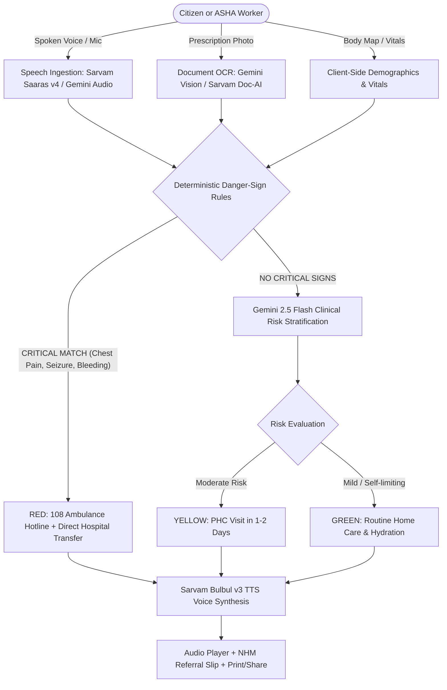

# 🏥 AarogyaVani (आरोग्यवाणी)
**Voice-First AI Clinical Triage & Referral Assistant for Rural Healthcare**

[](https://www.typescriptlang.org/)
[](https://react.dev/)
[](https://vitejs.dev/)
[](https://tailwindcss.com/)
[](https://opensource.org/licenses/MIT)

> **Team LocalHost Boys** • GDG HBTU • Bit N Build '26 Hackathon (HealthTech Track)

---

## 📌 Executive Overview
In rural India, the doctor-to-population ratio often exceeds **1:25,000**, and high linguistic diversity creates severe communication barriers. **AarogyaVani (आरोग्यवाणी)** bridges this gap with a voice-first clinical triage assistant designed for **Accredited Social Health Activists (ASHAs)** and **rural citizens**.

Patients or ASHAs speak natural symptoms in Indian languages or regional dialects; the system digitizes prescriptions via multimodal vision, enforces deterministic danger-sign safety gates, stratifies clinical risk into **RED / YELLOW / GREEN**, and synthesizes vernacular spoken guidance alongside an official National Health Mission (NHM) referral slip.

---

## 🌟 Key Features

### 1. 🌐 Multilingual Vernacular Localization (Default: Hindi)
- **Hindi (`hi`, Default)**: Primary national language across all clinical and citizen touchpoints.
- **English (`en`)**: Urban citizen, clinician, and technical evaluator mode.
- **Bengali (`bn`)**: Eastern region frontline coverage.
- **Telugu (`te`)**: Southern region community healthcare.
- **Marathi (`mr`)**: Western region PHCs and sub-centres.
- **Compact Header Toggle**: Glassmorphism dropdown with native scripts and auto-dismiss.

### 2. 👥 Dual-Persona Architecture
- **Citizen / Patient Mode (मरीज़)**: Minimalist, voice-first guidance with zero jargon and immediate 108 emergency dialer.
- **ASHA Worker Mode (आशा)**: Field-ready beneficiary registration (Name, Age, Gender), optional clinical vitals entry (Temp, Pulse, BP, SpO2), and official ASHA sign-off badge (`आशा कार्यकर्ता द्वारा सत्यापित ✓`).

### 3. 🎤 Resilient Speech-to-Text & Audio Guidance
- **Two-tier Speech AI**: Primary ingestion via **Sarvam Saaras v4**, seamlessly backed by **Google Gemini Multimodal Audio** for obscure dialects (Bhojpuri, Maithili, etc.) and code-mixed speech (Hinglish).
- **Voice Guidance**: Generates spoken guidance in native Hindi using **Sarvam Bulbul v3 TTS**.

### 4. 📄 Multimodal Document OCR
- High-speed handwritten prescription & lab report extraction via **Gemini Vision OCR** with automated fallback to **Sarvam Doc-AI Digitise**.

### 5. 🛡️ Deterministic Danger Gates (Zero-Hallucination Safety)
- Hardcoded clinical red-flag rules catch life-threatening cardiac, respiratory, neurological, and obstetric emergencies in **<100ms** client-side, bypassing probabilistic LLM hallucinations.

### 6. 🫀 Interactive Anatomical Body Map & Vitals Gauges
- Tap-to-select body regions (Head, Chest, Stomach, Arms, Legs, Back, Full Body) designed for low-literacy patients.
- Clinical vitals tracking with normal/abnormal range indicators.

---

## 🛠️ Architecture & Multi-Model Pipeline



---

## 💻 Tech Stack

| Layer | Technologies & Services | Purpose |
| :--- | :--- | :--- |
| **Frontend** | React 19, TypeScript 5.7, Vite 6, Tailwind CSS 3.4, Lucide Icons | Responsive, high-contrast, accessible UI |
| **Serverless Backend** | Netlify Functions v2 (TypeScript) | Secure API proxying and multi-model coordination |
| **Voice AI (ASR & TTS)** | Sarvam AI Saaras v4 & Bulbul v3 (`hi-IN`) | Speech-to-text and natural voice output |
| **Multimodal Vision** | Google Gemini Vision OCR & Sarvam Doc-AI | Prescription and lab report digitization |
| **AI Risk Stratification** | Google Gemini 2.5 Flash / Flash-Lite | Clinical reasoning and structured triaging |
| **Safety Engine** | Deterministic Regex & Rule-Based Matchers | Instant red-flag danger sign intervention |

---

## 🚀 Quick Start Guide

### Prerequisites
- Node.js 18+ or 20+
- npm 9+

### Installation & Setup

1. **Clone the repository:**
   ```bash
   git clone <repo-url>
   cd main
   ```

2. **Install dependencies:**
   ```bash
   npm install
   ```

3. **Configure Environment Variables:**
   ```bash
   cp .env.example .env
   ```
   Add your API keys to `.env`:
   ```env
   SARVAM_API_KEY=your_sarvam_api_key_here
   GEMINI_API_KEY=your_gemini_api_key_here
   ```

4. **Launch Development Server:**
   ```bash
   npm run dev
   ```
   Open `http://localhost:5173` in your browser.

5. **Run Production Build:**
   ```bash
   npm run build
   ```

6. **Run End-to-End Integration Tests:**
   ```bash
   npm test
   ```

---

## 📁 Repository Structure

```
main/
├── dist/                     # Optimized production bundle
├── docs/
│   └── screenshots/          # Showcase UI screenshots across languages & devices
├── netlify/
│   └── functions/            # Serverless API endpoints
│       ├── _gemini.ts        # Resilient Gemini multi-model fallback handler
│       ├── check.ts          # Danger-sign gate + clinical risk assessment
│       ├── scan.ts           # Vision OCR endpoint (Gemini + Sarvam fallback)
│       └── voice.ts          # Speech transcription (Sarvam + Gemini audio fallback)
├── public/
│   └── samples/              # Audio & prescription test samples
├── src/
│   ├── components/           # UI components
│   │   ├── BodyMap.tsx       # Anatomical body region picker
│   │   ├── DocumentScanner.tsx# Prescription upload & live laser scanner
│   │   ├── Footer.tsx        # Multilingual footer with health helplines
│   │   ├── LanguageSelector.tsx # Compact glassmorphic language switcher
│   │   ├── ResultCard.tsx    # NHM referral slip & triage result
│   │   ├── StepIndicator.tsx # 3-step navigation stepper
│   │   ├── VitalsInput.tsx   # Clinical vitals gauges
│   │   ├── VoiceButton.tsx   # Acoustic voice intake hero
│   │   └── VoicePlayer.tsx   # Vernacular audio playback component
│   ├── hooks/                # Audio recording & hardware hooks
│   ├── lib/                  # Utilities, API clients, i18n, rules, types
│   │   ├── api.ts            # Network client for serverless functions
│   │   ├── constants.ts      # Clinical triage constants
│   │   ├── i18n.ts           # Multi-language localization dictionary
│   │   ├── rules.ts          # Deterministic emergency danger-sign rules
│   │   └── types.ts          # TypeScript domain models
│   ├── App.tsx               # Main state reducer & triage workflow orchestrator
│   └── index.css             # Medical dark-depth styling & animations
├── DOCUMENTATION.md          # Comprehensive technical & clinical whitepaper
└── README.md                 # Project documentation & runbook
```

---

## 📸 Screenshots & Showcase

Curated high-resolution UI captures are available in [`docs/screenshots/`](docs/screenshots/):
- **Default Hindi View**: [`screenshot_lang_hindi.png`](docs/screenshots/screenshot_lang_hindi.png)
- **Language Switcher Menu**: [`screenshot_lang_menu.png`](docs/screenshots/screenshot_lang_menu.png)
- **English View**: [`screenshot_lang_english.png`](docs/screenshots/screenshot_lang_english.png)
- **Bengali View**: [`screenshot_lang_bengali.png`](docs/screenshots/screenshot_lang_bengali.png)
- **Telugu View**: [`screenshot_lang_telugu.png`](docs/screenshots/screenshot_lang_telugu.png)
- **Marathi View**: [`screenshot_lang_marathi.png`](docs/screenshots/screenshot_lang_marathi.png)
- **Mobile Responsive View (iPhone 14/15)**: [`screenshot_lang_mobile.png`](docs/screenshots/screenshot_lang_mobile.png)
- **ASHA Verified Referral Slip**: [`screenshot_ui_asha_verified.png`](docs/screenshots/screenshot_ui_asha_verified.png)

---

## 📖 In-Depth Whitepaper
For an exhaustive breakdown of the architectural philosophies, clinical evidence bases (WHO IMNCI standards), edge fallbacks, and National Health Mission compliance, see **[`DOCUMENTATION.md`](DOCUMENTATION.md)**.

---

## ⚠️ Clinical Disclaimer
AarogyaVani is a **clinical triage and primary navigation assistant**, **NOT a diagnostic or therapeutic medical device**. It does not prescribe medications or deliver definitive medical diagnoses. In any acute health crisis, users are directed immediately to the National Emergency Ambulance Service (`108`) or the nearest healthcare institution.

---

## 👥 Team LocalHost Boys
*GDG HBTU — Bit N Build '26 Hackathon (HealthTech Track)*

- **Prashant Gautam**
- **Prathvi Goswami**
- **Ankit Kumar**
- **Love Gwal**

*Built with care for India's 1 Million+ frontline ASHA workers and 850 Million+ rural citizens.*

